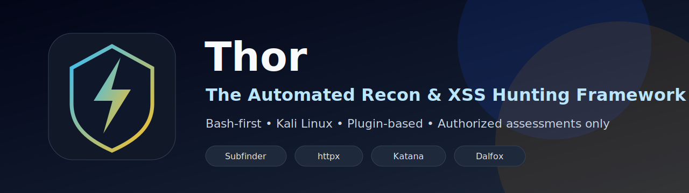

<p align="center">
  
</p>

<h1 align="center">⚡ Thor</h1>
<p align="center"><strong>The Automated Recon &amp; XSS Hunting Framework</strong></p>
<p align="center">
  
  
  
  
  
</p>

Thor is a production-ready Bash framework for authorized reconnaissance, URL collection, parameter filtering, and Dalfox-powered XSS testing on Kali Linux. It does not exploit systems or bypass controls. It orchestrates established open-source tools, keeps a clear audit trail, and generates consistent TXT, JSON, and HTML reports.

> **Use Thor only on systems you own or are explicitly authorized to assess.**

## Features

- Bash 5+ backend with no Python workflow dependency.
- Modular plugin architecture for easy extension.
- Passive subdomain enumeration with Subfinder and Sublist3r.
- Optional live host validation with httpx.
- URL collection through ParamSpider, gau, waymore, and katana.
- Deduplication after every major stage.
- Strict scoped URL validation before Dalfox.
- Single-parameter URL normalization for focused XSS testing.
- Dalfox-only XSS scanner integration with version-aware flag handling.
- Conservative batching to prevent open-file exhaustion on large scans.
- Real stdout/stderr logging, exit code capture, elapsed time, retries, and failure reasons.
- Resume support through per-scan state files.
- Dark themed HTML dashboard with search/filter and export support.
- CLI and lightweight Zenity/YAD GUI.
- GitHub Actions for Bash syntax, ShellCheck, shfmt, and release packaging.

## Architecture overview

```text
Target domain
  ↓
10_subdomains.sh        Subfinder + Sublist3r
  ↓
20_live_hosts.sh        Optional httpx live host probing
  ↓
30_paramspider.sh       Parameter discovery
40_gau.sh               Archive URL collection
50_waymore.sh           Wayback URL collection
60_katana.sh            Crawling
  ↓
70_merge_urls.sh        Merge + deduplicate
  ↓
80_filter_urls.sh       Strict single-parameter filtering
  ↓
90_dalfox.sh            Scoped, batched Dalfox XSS scan
  ↓
reporting.sh            TXT / JSON / HTML reports
```

The core engine (`thor.sh`) loads plugins from `modules/plugins/`. New modules can register themselves through `register_module` without changing the main pipeline.

## Technologies used

- Bash 5+
- GNU coreutils, grep, sed, awk, jq
- Subfinder
- Sublist3r
- ParamSpider
- Dalfox
- Optional: httpx, gau, waymore, katana
- Optional GUI: Zenity or YAD
- Optional development tools: ShellCheck and shfmt

## Requirements

Required CLI tools:

```text
bash git curl wget grep sed awk jq subfinder sublist3r paramspider dalfox
```

Recommended optional tools:

```text
httpx gau waymore katana zenity yad shellcheck shfmt
```

Check dependencies:

```bash
thor doctor
```

Install missing dependencies where possible:

```bash
thor doctor --install
```

## Installation

### From release zip

```bash
cd ~
unzip Thor-github-ready-v1.0.0.zip -d Thor
cd Thor
chmod +x install.sh thor.sh gui/thor-gui.sh
./install.sh
```

### From GitHub clone

```bash
git clone https://github.com/<your-username>/thor-xss-framework.git
cd thor-xss-framework
chmod +x install.sh thor.sh gui/thor-gui.sh
./install.sh
```

Verify:

```bash
thor --version
thor doctor
```

## CLI usage

Interactive menu:

```bash
thor
```

Single authorized domain:

```bash
thor scan example.com
```

Skip the interactive authorization prompt only when you already have written permission:

```bash
thor scan example.com --authorized
```

Multiple domains:

```bash
thor scan -l domains.txt --authorized
```

Resume latest scan:

```bash
thor resume
```

Regenerate report:

```bash
thor report
```

Show history:

```bash
thor history
```

Clean temporary files:

```bash
thor clean
```

## Dalfox tuning examples

Safe default scan:

```bash
thor scan example.com --authorized
```

Lower concurrency for slow targets:

```bash
thor scan example.com --authorized --dalfox-workers 15 --dalfox-batch-size 100
```

Skip URL-level live precheck:

```bash
thor scan example.com --authorized --no-dalfox-precheck-live
```

Use an authorized proxy:

```bash
thor scan example.com --authorized --proxy http://127.0.0.1:8080
```

Use authorized cookies or headers:

```bash
thor scan example.com --authorized --cookie "SESSION=REDACTED" --header "X-Test-Scope: authorized"
```

## GUI usage

Install Zenity or YAD:

```bash
sudo apt install -y zenity
```

Launch:

```bash
thor-gui
```

or:

```bash
thor gui
```

GUI features include scan start/stop, live console, results folder access, report export, dependency check, and settings access.

## Configuration

Configuration lives in `config.conf`. Precedence is:

```text
CLI arguments > THOR_* environment variables > config.conf > built-in defaults
```

Recommended defaults:

```conf
DALFOX_WORKERS="25"
DALFOX_TIMEOUT="8"
DALFOX_RETRIES="1"
DALFOX_BATCH_SIZE="250"
DALFOX_PRECHECK_LIVE="true"
DALFOX_REQUIRE_LIVE_HOSTS="true"
DALFOX_SCOPE_ONLY="true"
DALFOX_ULIMIT="8192"
DALFOX_USE_OUTPUT_FLAG="false"
```

Use `.env.example` as a safe reference for local environment overrides. Do not commit real cookies, tokens, API keys, or private target data.

## Output explanation

Every scan creates a timestamped directory:

```text
results/example.com/YYYY-MM-DD_HH-MM-SS/
```

Key files:

```text
subfinder.txt                 Raw Subfinder output
sublist3r.txt                 Raw Sublist3r output
subdomains.txt                Deduplicated subdomains
live_hosts.txt                Optional live host list
paramspider/                  Per-host ParamSpider output
paramspider.txt               Merged ParamSpider output
gau.txt                       gau output
waymore.txt                   waymore output
katana.txt                    katana output
allparams.txt                 Merged URL collection
single_param_urls.txt         Filtered single-parameter URLs
dalfox_input.txt              Strict scoped Dalfox input
dalfox_input_live.txt         Optional live-checked Dalfox input
dalfox_skipped_urls.txt       Rejected URL reasons
dalfox_unreachable_urls.txt   URL precheck failures
dalfox_result.txt             Dalfox text output or failure summary
dalfox_result.json            Normalized findings source of truth
dalfox_error.log              Real Dalfox stderr
report.txt                    Human-readable report
report.json                   Machine-readable report
report.html                   Dark themed dashboard
logs.txt                      Full command logs and errors
state.env                     Resume state and metrics
```

## Report integrity

Thor does not estimate vulnerability counts from generic words in logs. The source of truth is:

```text
dalfox_result.json.findings_count
```

If Dalfox fails, reports mark the Dalfox status as `failed` and preserve the real reason in `dalfox_error.log`, `dalfox_result.txt`, and `report.json`.

## Screenshots

Screenshots can be added under `docs/screenshots/`.

Suggested screenshots:

- CLI scan start
- GUI launcher
- HTML report dashboard
- Dependency check output

## Security disclaimer

Thor sends active web testing payloads through Dalfox. Use it only on assets you own or are explicitly authorized to test. Scans may trigger logging, alerts, rate limits, or blocking controls. Always follow the agreed rules of engagement.

## Legal disclaimer

This project is provided for educational purposes and authorized security assessments only. The maintainers are not responsible for misuse, unauthorized testing, service disruption, legal consequences, or damage caused by improper use.

## Contributing

Contributions are welcome when they preserve Thor's safety model. Read `CONTRIBUTING.md` before opening a pull request.

Quick development checks:

```bash
mapfile -t scripts < <(find . -type f -name '*.sh' -not -path './results/*' -not -path './logs/*')
bash -n "${scripts[@]}"
shellcheck "${scripts[@]}"
shfmt -d "${scripts[@]}"
```

## Future roadmap

- Plugin metadata manifest support.
- Optional Naabu live port discovery plugin.
- Optional FFUF content discovery plugin.
- Richer HTML report charts.
- Report comparison between scans.
- Docker/devcontainer environment.
- Safer per-plugin rate limit controls.

## Credits

Thor orchestrates excellent open-source security tools including Dalfox, Subfinder, Sublist3r, ParamSpider, gau, waymore, katana, and httpx. Credit belongs to their respective authors and maintainers.

## License

MIT License. See `LICENSE`.
